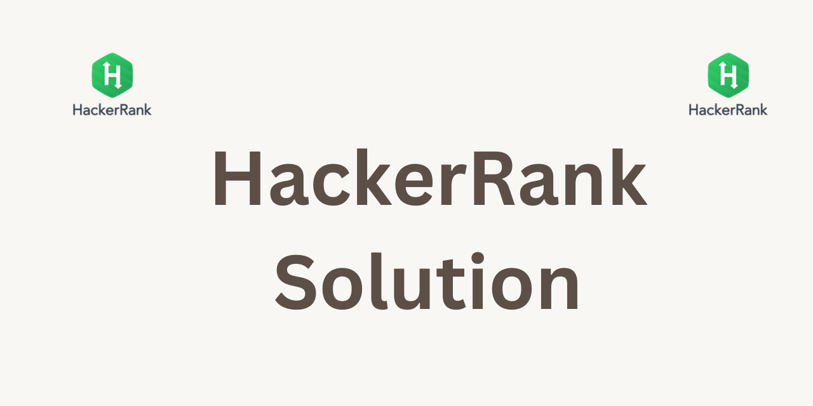

# HackerRank
HackerRank Solution to Practice Problem in Various Domain.

# Only For Educational Purpose use it as Reference not a point of solution

This repository contains 55 solutions to Hackerrank practice problems with Python 3.

Updated daily :) If it was helpful please press a star.

 

 

- .github
    ISSUE_TEMPLATE
- Interview Preparation Kit
    1 Week Preparation Kit
- Python
    01. Introduction
        - Say Hello, World! With Python | [Problem](https://www.hackerrank.com/challenges/py-hello-world/problem) | [Solution](https://github.com/nithishsingh/HackerRank-Solution/blob/master/Python/01.%20Introduction/001.%20Say%20Hello,%20World!%20With%20Python.py) | Score: 5
        - Python If-Else | [Problem](https://www.hackerrank.com/challenges/py-if-else/problem) | [Solution](https://github.com/nithishsingh/HackerRank-Solution/blob/master/Python/01.%20Introduction/002.%20Python%20If-Else.py) | Score: 10
        - Arithmetic Operators | [Problem](https://www.hackerrank.com/challenges/python-arithmetic-operators/submissions/code/70402456) | [Solution](https://github.com/nithishsingh/HackerRank-Solution/blob/master/Python/01.%20Introduction/003.%20Arithmetic%20Operators.py) | Score: 10
        - Python Division | [Problem](https://www.hackerrank.com/challenges/python-division/problem) | [Solution](https://github.com/nithishsingh/HackerRank-Solution/blob/master/Python/01.%20Introduction/004.%20Python%20Division.py) | Score: 10
        - Loops | [Problem](https://www.hackerrank.com/challenges/python-loops/problem) | [Solution](https://github.com/nithishsingh/HackerRank-Solution/blob/master/Python/01.%20Introduction/005.%20Loops.py) | Score: 10
        - Write a function | [Problem](https://www.hackerrank.com/challenges/write-a-function/problem) | [Solution](https://github.com/nithishsingh/HackerRank-Solution/blob/master/Python/01.%20Introduction/006.%20Write%20a%20function.py) | Score: 10
        - Print Function | [Problem](https://www.hackerrank.com/challenges/python-print/problem) | [Solution](https://github.com/nithishsingh/HackerRank-Solution/blob/master/Python/01.%20Introduction/007.%20Print%20Function.py) | Score: 20
    02. Basic Data Types
        - List Comprehensions | [Problem](https://www.hackerrank.com/challenges/list-comprehensions/problem) | [Solution](https://github.com/nithishsingh/HackerRank-Solution/blob/master/Python/02.%20Basic%20Data%20Types/001.%20List%20Comprehensions.py) | Score: 10
        - Find the Runner-Up Score! | [Problem](https://www.hackerrank.com/challenges/find-second-maximum-number-in-a-list/problem) | [Solution](https://github.com/nithishsingh/HackerRank-Solution/blob/master/Python/02.%20Basic%20Data%20Types/002.%20Find%20the%20Runner-Up%20Score!.py) | Score: 10
        - Nested Lists | [Problem](https://www.hackerrank.com/challenges/nested-list/problem) | [Solution](https://github.com/nithishsingh/HackerRank-Solution/blob/master/Python/02.%20Basic%20Data%20Types/003.%20Nested%20Lists.py) | Score: 10
        - Finding the percentage | [Problem](https://www.hackerrank.com/challenges/finding-the-percentage/problem) | [Solution](https://github.com/nithishsingh/HackerRank-Solution/blob/master/Python/02.%20Basic%20Data%20Types/004.%20Finding%20the%20percentage.py) | Score: 10
        - Lists | [Problem](https://www.hackerrank.com/challenges/python-lists/problem) | [Solution](https://github.com/nithishsingh/HackerRank-Solution/blob/master/Python/02.%20Basic%20Data%20Types/005.%20Lists.py) | Score: 10
        - Tuples | [Problem](https://www.hackerrank.com/challenges/python-tuples/problem) | [Solution](https://github.com/nithishsingh/HackerRank-Solution/blob/master/Python/02.%20Basic%20Data%20Types/006.%20Tuples.py) | Score: 10
    03. Strings
        - sWAP cASE | [Problem](https://www.hackerrank.com/challenges/swap-case/problem) | [Solution](https://github.com/nithishsingh/HackerRank-Solution/blob/master/Python/03.%20Strings/001.%20sWAP%20cASE.py) | Score: 10
        - String Split and Join | [Problem](https://www.hackerrank.com/challenges/python-string-split-and-join/problem) | [Solution](https://github.com/nithishsingh/HackerRank-Solution/blob/master/Python/03.%20Strings/002.%20String%20Split%20and%20Join.py) | Score: 10
        - What's Your Name | [Problem](https://www.hackerrank.com/challenges/whats-your-name/problem) | [Solution](https://github.com/nithishsingh/HackerRank-Solution/blob/master/Python/03.%20Strings/003.%20What's%20Your%20Name.py) | Score: 10
        - Mutations | [Problem](https://www.hackerrank.com/challenges/python-mutations/problem) | [Solution](https://github.com/nithishsingh/HackerRank-Solution/blob/master/Python/03.%20Strings/004.%20Mutations.py) | Score: 10
        - Find a string | [Problem](https://www.hackerrank.com/challenges/find-a-string/problem) | [Solution](https://github.com/nithishsingh/HackerRank-Solution/blob/master/Python/03.%20Strings/005.%20Find%20a%20string.py) | Score: 10
        - String Validators | [Problem](https://www.hackerrank.com/challenges/string-validators/problem) | [Solution](https://github.com/nithishsingh/HackerRank-Solution/blob/master/Python/03.%20Strings/006.%20String%20Validators.py) | Score: 10
        - Text Alignment | [Problem](https://www.hackerrank.com/challenges/text-alignment/problem) | [Solution](https://github.com/nithishsingh/HackerRank-Solution/blob/master/Python/03.%20Strings/007.%20Text%20Alignment.py) | Score: 10
        - Text Wrap | [Problem](https://www.hackerrank.com/challenges/text-wrap/problem) | [Solution](https://github.com/nithishsingh/HackerRank-Solution/blob/master/Python/03.%20Strings/008.%20Text%20Wrap.py) | Score: 10
        - Designer Door Mat | [Problem](https://www.hackerrank.com/challenges/designer-door-mat/problem) | [Solution](https://github.com/nithishsingh/HackerRank-Solution/blob/master/Python/03.%20Strings/009.%20Designer%20Door%20Mat.py) | Score: 10
        - String Formatting | [Problem](https://www.hackerrank.com/challenges/python-string-formatting/problem) | [Solution](https://github.com/nithishsingh/HackerRank-Solution/blob/master/Python/03.%20Strings/010.%20String%20Formatting.py) | Score: 10
        - Capitalize! | [Problem](https://www.hackerrank.com/challenges/capitalize/problem) | [Solution](https://github.com/nithishsingh/HackerRank-Solution/blob/master/Python/03.%20Strings/011.%20Capitalize!.py) | Score: 20
        - TheMergeTool | [Problem](https://www.hackerrank.com/challenges/merge-the-tools/problem) | [Solution](https://github.com/nithishsingh/HackerRank-Solution/blob/master/Python/03.%20Strings/012.%20TheMergeTool.py) | Score: 40
        - TheMinionGame | [Problem](https://www.hackerrank.com/challenges/the-minion-game/problem) | [Solution](https://github.com/nithishsingh/HackerRank-Solution/blob/master/Python/03.%20Strings/013.%20TheMinionGame.py) | Score: 40
- SQL
    01. Basic Select
        - Revising the Select Query I | [Problem](https://www.hackerrank.com/challenges/revising-the-select-query/problem) | [Solution](https://github.com/nithishsingh/HackerRank-Solution/blob/master/SQL/01.%20Basic%20Select/001.%20Revising%20the%20Select%20Query%20I.sql) | Score: 10
        - Revising the Select Query II | [Problem](https://www.hackerrank.com/challenges/revising-the-select-query-2/problem) | [Solution](https://github.com/nithishsingh/HackerRank-Solution/blob/master/SQL/01.%20Basic%20Select/002.%20Revising%20the%20Select%20Query%20II.sql) | Score: 10
        - Select All | [Problem](https://www.hackerrank.com/challenges/select-all-sql/problem) | [Solution](https://github.com/nithishsingh/HackerRank-Solution/blob/master/SQL/01.%20Basic%20Select/003.%20Select%20All.sql) | Score: 10
        - Select By ID | [Problem](https://www.hackerrank.com/challenges/select-by-id/problem) | [Solution](https://github.com/nithishsingh/HackerRank-Solution/blob/master/SQL/01.%20Basic%20Select/004.%20Select%20By%20ID.sql) | Score: 10
        - Japanese Cities' Attributes | [Problem](https://www.hackerrank.com/challenges/japanese-cities-attributes/problem) | [Solution](https://github.com/nithishsingh/HackerRank-Solution/blob/master/SQL/01.%20Basic%20Select/005.%20Japanese%20Cities'%20Attributes.sql) | Score: 10
        - Japanese Cities' Names | [Problem](https://www.hackerrank.com/challenges/japanese-cities-name/problem) | [Solution](https://github.com/nithishsingh/HackerRank-Solution/blob/master/SQL/01.%20Basic%20Select/006.%20Japanese%20Cities'%20Names.sql) | Score: 10
        - Weather Observation Station 1 | [Problem](https://www.hackerrank.com/challenges/weather-observation-station-1/problem) | [Solution](https://github.com/nithishsingh/HackerRank-Solution/blob/master/SQL/01.%20Basic%20Select/007.%20Weather%20Observation%20Station%201.sql) | Score: 15
        - Weather Observation Station 3 | [Problem](https://www.hackerrank.com/challenges/weather-observation-station-3/problem) | [Solution](https://github.com/nithishsingh/HackerRank-Solution/blob/master/SQL/01.%20Basic%20Select/008.%20Weather%20Observation%20Station%203.sql) | Score: 10
        - Weather Observation Station 4 | [Problem](https://www.hackerrank.com/challenges/weather-observation-station-4/problem) | [Solution](https://github.com/nithishsingh/HackerRank-Solution/blob/master/SQL/01.%20Basic%20Select/009.%20Weather%20Observation%20Station%204.sql) | Score: 10
        - Weather Observation Station 5 | [Problem](https://www.hackerrank.com/challenges/weather-observation-station-5/problem) | [Solution](https://github.com/nithishsingh/HackerRank-Solution/blob/master/SQL/01.%20Basic%20Select/010.%20Weather%20Observation%20Station%205.sql) | Score: 30
        - Weather Observation Station 6 | [Problem](https://www.hackerrank.com/challenges/weather-observation-station-6/problem) | [Solution](https://github.com/nithishsingh/HackerRank-Solution/blob/master/SQL/01.%20Basic%20Select/011.%20Weather%20Observation%20Station%206.sql) | Score: 10
        - Weather Observation Station 7 | [Problem](https://www.hackerrank.com/challenges/weather-observation-station-7/problem) | [Solution](https://github.com/nithishsingh/HackerRank-Solution/blob/master/SQL/01.%20Basic%20Select/012.%20Weather%20Observation%20Station%207.sql) | Score: 10
        - Weather Observation Station 8 | [Problem](https://www.hackerrank.com/challenges/weather-observation-station-8/problem) | [Solution](https://github.com/nithishsingh/HackerRank-Solution/blob/master/SQL/01.%20Basic%20Select/013.%20Weather%20Observation%20Station%208.sql) | Score: 15
        - Weather Observation Station 9 | [Problem](https://www.hackerrank.com/challenges/weather-observation-station-9/problem) | [Solution](https://github.com/nithishsingh/HackerRank-Solution/blob/master/SQL/01.%20Basic%20Select/014.%20Weather%20Observation%20Station%209.sql) | Score: 10
    02. Advanced Select
        - Type of Triangle | [Problem](https://www.hackerrank.com/challenges/what-type-of-triangle/problem) | [Solution](https://github.com/nithishsingh/HackerRank-Solution/blob/master/SQL/02.%20Advanced%20Select/001.%20Type%20of%20Triangle.sql) | Score: 20
        - The PADS | [Problem](https://www.hackerrank.com/challenges/the-pads/problem) | [Solution](https://github.com/nithishsingh/HackerRank-Solution/blob/master/SQL/02.%20Advanced%20Select/002.%20The%20PADS.sql) | Score: 30
        - Binary Tree Nodes | [Problem](https://www.hackerrank.com/challenges/binary-search-tree-1/problem) | [Solution](https://github.com/nithishsingh/HackerRank-Solution/blob/master/SQL/02.%20Advanced%20Select/004.%20Binary%20Tree%20Nodes.sql) | Score: 30
- asset
    png
